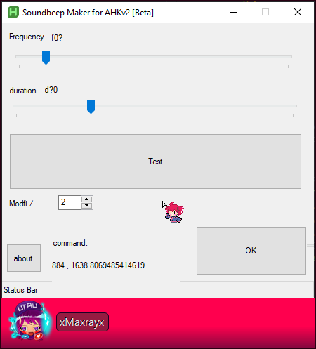

# Sound beep Creator for AHKv2

a Small GUI program for creating `Soundbeep` commands for AHKv2.

### Requirement :

- AHk v2 is installed in your OS.

  
# Changelog:

##  0.0.2 (Beta)

## 0.0.1v (Beta)

- First release 

# For Development:

##  Bugs:

- Frequency textbox write from (Right to Left)

## Changes:

## Planned Future:

- add a Duration text box to change 

## Idea

Auto-merged at 04:13:52 AM 2023/06/30	

